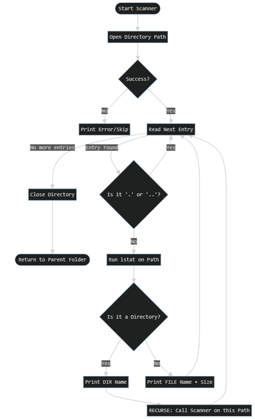

Linux Directory Scanner
--

This Project will illustrate, use of a basic directory scanner functionality created using cpp.

Tools and Resources
--
Draw.io - for flow representation

VS Code - Coding and Debugging, Testing

Gemini - AI Assitant

SRS [Check out the documentation](SRS.md)
--
Update in another readme file

Process Flow
--

How to use/Install
--
Creating .deb type file for apt installation - check process

License and Project Use:
--
GNU GENERAL PUBLIC LICENSE v3
